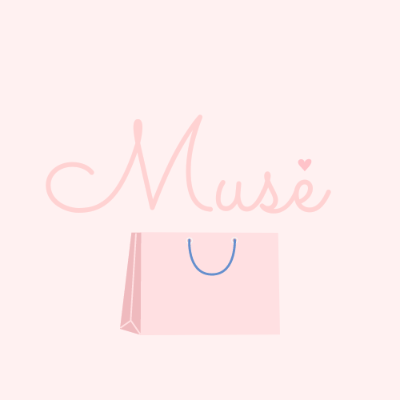

# Muse

An app designed for the customer by the customer. 

Muse is a customer driven app that prioritizes the customer's needs by bringing the seller to the buyer. Instead of looking through countless listings only to not find what you’re looking for; you create a listing containing the item you want and the sellers, merchants, and retailers offer you the product. Additionally, we offer a social media-esque platform to help you curate your perfect shopping list; allowing you to organize what you’re looking for in aesthetically pleasing categories and giving your posts more visibility. 

## Pain Point 
Just as users spend countless hours scrolling through various social media platforms. Online shoppers also spend a copious  amount of time scrolling through listings only to come away with absolutely nothing. To fix that, customers create the product listings because they know exactly what they want best.

<h1 align="center">
   
  
   
  Muse
   
</h1>

<h4 align="center">An app designed for the customer by the customer.<a href="http://muse-shopping.com" target="_blank">Muse</a>.</h4>

  <a href="#key-features">Key Features</a> •
  <a href="#how-to-use">How To Use</a> •

## Key Features

* Messaging - Sellers can message potential buyers on their listing.
  - When signed in a seller, sellers can message specific buyers for a specfic listing.
* Social Media Platform Design
  - Muse offers a social media-esque platform with customizeable features coming soon.
* Mark an item as purchased
  - If a buyer has already purchased an item, there's an option to mark the item as purchased.

## How To Use

- Customers 
To get started, locate the get started option on the landing page and choose whether you sign up as a buyer or a seller. 
- Navigate to the new listings tab or click the plus sign in the bottom navigation bar.
- Upload a picture of the item you're looking for.
- Provide a caption that contains a description or details about the item.
- Post the item.

- Sellers 

Upon creating an account choose "seller".
- Once signed in, navigate to the home page to message potential buyers.
- After you and the buyer have agreed upon a price, you have the option to create an offer.
- Once the buyer has agreed to the offer the transaction is complete.
